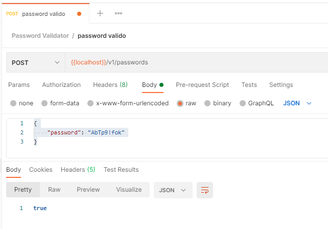

# Password Validator

Uma API para validar se a senha fornecida pelo usuário é válida de acordo com as seguintes regras:

- Nove ou mais caracteres
- Ao menos 1 dígito
- Ao menos 1 letra minúscula
- Ao menos 1 letra maiúscula
- Ao menos 1 caractere especial
  - Considere como especial os seguintes caracteres: !@#$%^&*()-+
  - Espaços em branco não devem ser considerados como caracteres válidos
- Não possuir caracteres repetidos dentro do conjunto

## Documentação da API
- HTML: http://localhost:8080/swagger-ui.html
- YAML: http://localhost:8080/v3/api-docs.yaml

## Tecnologias
- Java 1.8
- Springboot

## Como testar
Enviar um payload contendo o password, conforme exemplo abaixo, utilizando-se de um método POST para o endpoint /v1/passwords.
  

  
O Service PasswordValidatorService instancia uma classe RulesChecker contendo todas as regras a serem aplicadas, cujas são implementações da interface IPasswordRules. 

Após, é retornado um boolean informado se a senha é válida ou não.

OBS.: Para fins de teste, quando uma regra não é satisfeita, é realizado um log com o nome da regra.

## Teste de performance
Utilizando-se do Postman, executei um teste em máquina local com 7 payloads diferentes e 200 requisições, totalizando 1400 chamadas ao endpoint. O log de testes está disponível  e os tempos aferidos foram:

Quantidade|Mínimo (ms)|Média (ms)|Máximo (ms)
----------|----------|----------|----------|
1400|3,0|4,14|8,00
